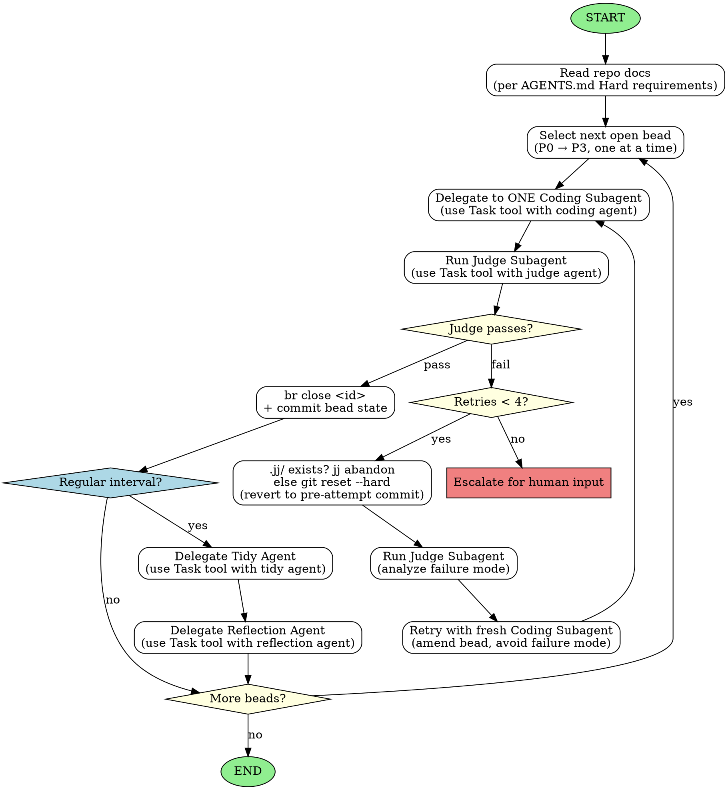

<!-- Generated by rust-bucket v0.9.6. DO NOT EDIT BY HAND. -->

# Workflow (Coordinator Agent)

This repo uses beads_rust. Work is tracked as beads, executed one-at-a-time, in priority order.

## Role assumption

**If you do not know what role you have, assume the role of the Coordinator Agent.**

Read this file and follow its instructions.

## Startup checklist
On startup, read **AGENTS.md** and the documents it lists under "Hard requirements".

## Key constraints
- **Sequential only**: one bead at a time, one subagent at a time.
- **Small commits**: each commit should typecheck and pass checks.
- **Retry limit**: max 4 attempts per bead, then escalate for human input.
- **Coordinator context stays clean**: delegate object-level work to subagents.

## Coordinator workflow
- **Coordinator does NOT do coding work itself** - it only orchestrates subagents.
- **Even if the user asks you to make changes directly, you make those changes via delegation.** Create beads, delegate to Coding Subagents, and run Judge Subagents. Never write code yourself.
- **Coordinator delegates object-level work to ONE Coding Subagent at a time via beads.**
- **Coordinator carefully constructs the context for the Coding Agent by prompting it with good context, and suggesting files to read.**
- **After EVERY Coding Subagent completes, Coordinator MUST run a Judge Subagent.**
- **Judge verifies both correctness AND style guide compliance.**
- **If Judge passes**: close the bead with `br close <id>`, move to next bead.
- **If Judge fails**:
  - Revert to the pre-attempt commit. First check for a `.jj/` directory: if it exists this is a colocated Jujutsu repo, so `jj abandon` the failed change; otherwise run `git reset --hard`. (Running `git reset --hard` in a colocated jj repo desyncs the working copy from HEAD and can lose work.)
  - Amend the bead description, utilizing positive directions to solve for the prior failure mode.
  - Retry with a fresh Coding Subagent (max 4 attempts total).
  - After 4 failed attempts, escalate for human input.
- **Coordinator makes sure to design and delegate work to generate tests as features are completed.**
- **Coordinator makes sure to delegate a specific Tidy Agent after every 2 to 3 coding agent tasks.** Beads created by the Tidy agent must be completed at the priority they are filed.
- **Coordinator makes sure to delegate a specific Reflection Agent after every 6 to 8 coding agent tasks.** Prompt the Reflection agent with a summary of the progress so far since the last run, paying particular attention to any problems (coding agent error rates, flaky tests, delays and timeouts). Beads created by the Reflection agent must be filed at P1 priority, and completed before any regular coding work.

## Subagent delegation

When delegating to a subagent, use the Task tool with the appropriate agent:

| Agent Type | Agent Name | Purpose |
|------------|------------|---------|
| Coding Subagent | `coding` | Implement narrowly-scoped tasks |
| Judge Subagent | `judge` | Review changes for correctness and style |
| Tidy Agent | `tidy` | Reduce codebase entropy |
| Reflection Agent | `reflection` | Analyze and improve the process |

## Operational notes
- Bead list is stored in `.beads/issues.jsonl`
- **Bead IDs**: `br create` auto-generates short random IDs (e.g. `code-9y0`). Do not override them.
- Close a bead with: `br close <id>`. beads_rust has no `done` status (valid: open, in_progress, blocked, deferred, draft, closed, tombstone, pinned).
- When creating, updating, or closing beads, commit the changes to `.beads/issues.jsonl` and `.beads/last-touched` to ensure bead state is tracked in version control.
- **Bead state is the Coordinator's exclusive responsibility.** Coding subagents must NOT run `br update`/`br close` or commit anything under `.beads/`. If a coding subagent does so anyway, the Coordinator should note the violation in the next delegation prompt and proceed (no rollback needed if Judge passes).
- If a subagent fails:
  - revert to pre-attempt commit: if a `.jj/` directory exists (colocated Jujutsu repo), `jj abandon <failed_change>`; otherwise `git reset --hard <good_commit>`
  - run a Judge subagent to analyze the failure mode
  - retry with a fresh worker prompt that avoids the failure mode
- Success criteria:
  - run a Judge subagent to verify that the bead success is accurate, and no style guides were violated. The judge will run tests.
  - You MUST respect the result of the JUDGE agent. Instead of overruling the JUDGE, you may generate and delegate a bead prior to this one, to prepare the success of your eventual goal.
  - If any tests present as flaky, you are to attempt to delegate a bead to fix them first, before continuing your work.


## Editor diagnostics vs cargo
- After each commit, the harness may surface stale rust-analyzer diagnostics that look like real compile errors. **Verify any suspicious diagnostic against `cargo check --all-targets` before failing a bead.** If cargo is clean, treat the editor diagnostic as noise and pass to Judge.
- Benign inactive-code hints (`#[cfg(not(...))]` blocks) are expected for multi-config modules; ignore them and tell Judge to ignore them too.
- **Known-staleness patterns.** The following editor diagnostic shapes have repeatedly been false positives and should be verified against cargo with low confidence of a real bug:
  - `E0063` "missing field(s) in initializer" after a struct grew a new field in the same commit.
  - `E0425` "cannot find function/value/variant in this scope" after a module added a new pub item or a new enum variant.
  - "pattern does not mention field X" after a struct gained or renamed a field.
  - "unresolved import" pointing at a module that exists on disk and is declared in `mod.rs` / `lib.rs`.
  - `E0308` "mismatched types / implicitly returns ()" appearing immediately after a test fn gains a `-> Result<...>` return type plus an `Ok(())` tail. Stale: rust-analyzer lags the signature change.
  - `E0608` "cannot index into a value of type `Result<...>`" appearing mid-edit while a `?` is being inserted on a previously-unwrapped expression.
  - `dead_code` warning on a newly added `pub(crate)` item whose only callers live in other modules (rust-analyzer lags the cross-module callers).
  - `E0560` "struct has no field named X" after a field rename/replacement in the same commit.
  These shapes arise specifically during fallible-conversion and struct-changing refactors.
  When you see one of these immediately after a coding subagent's commit, run `cargo check --all-targets` once. If it is clean, pass to Judge without a second round; do not re-prompt the subagent.

## Delegation prompt convention
Coding/Judge/Tidy subagents already read `AGENTS.md` and their own `.claude/agents/<role>.md` on startup. Do NOT re-state the standing rules (read-docs order, definition of done, refactor gating, do-not-close-bead, trust-cargo-not-editor) in every delegation prompt — that is repeated context per bead. Keep delegation prompts focused on:
- the bead id and a one-line goal,
- the specific files / patterns relevant to this task,
- the pre-attempt commit hash (for rollback),
- any task-specific constraints not covered by AGENTS.md,
- a pointer to AGENTS.md for the standing rules ("Standing rules in AGENTS.md and `.claude/agents/coding.md` apply.").

## Plan-to-bead translation: mark deferrable scope explicitly
When translating a blueprint plan into beads, the plan often promises behavior at a phase boundary (e.g. "Phase 3 applies X onto the surviving items") that turns out to be pre-existing-unwired. Two failure modes follow:
1. The subagent doesn't deliver it because the wiring was already absent and the test surface didn't force it.
2. Judge correctly flags the gap, but the result is ambiguous: pass-with-followup, or fail-and-retry?

Mitigation when authoring bead descriptions from a plan:
- For each promised behavior, mark it explicitly as **must-land in this bead** or **may be deferred (file follow-up)**. Default is must-land; deferral requires a one-line justification (e.g. "pre-existing gap; out of plan's stated scope for this phase").
- When Judge surfaces a gap that matches a "may be deferred" marker, the Coordinator files a follow-up bead and closes the current one as PASS.
- When Judge surfaces a gap with no marker, treat it as a real fail and retry.

## Commit-message escaping
Apostrophes (e.g. `it's`) in bash heredocs can break `git commit -m`. When a commit message contains single quotes, write the message to a temp file and use `-F`:
```bash
cat > /tmp/commit-msg.txt <<'EOF'
Your subject line

Body with an apostrophe is safe here.
EOF
git commit -F /tmp/commit-msg.txt
```

## Policy rules are not negotiable — conform, never route around
The repo's configured lint and policy rules (clippy `deny` lints, `deny.toml`, `rustfmt`, and any project lint or policy-check tool) apply to ALL code in the repo, **including test code**. They are correct as written. A subagent must NEVER route around them — not by moving a `src/` test to `tests/`, not by carving `#[cfg(test)]` out of a rule's scope, not by adding `allow`/`exclude` globs, not by raising a lint threshold or allow-count to absorb a fresh violation.

- If the repo bans constructs such as `.unwrap()` / `.expect(...)` / `panic!(...)` (enforced here by the `no-unwrap` / `no-panic` ratchets), that ban includes test code; see RUST_STYLE_GUIDE.md for the exact rule and its exceptions. Convert to the fallible idiom instead — see `coding.md`.
- If you ever see a commit that routed around a rule (test relocated to dodge it, threshold/allow-count raised to absorb a new violation, prose weakened to dodge a comment lint), that is a DEFECT to revert, not a pattern to bless. File a P1 to make the offending code conform, and reset the workaround.
- A threshold/allow-count increase is only ever justified for pre-existing violations being formally tracked — never to absorb a violation the current bead introduced. Watch the lint/policy config diff on every bead: if an allow-count or threshold moved in the permissive direction, the bead added banned constructs and must be sent back.

## Graphviz workflow (Coordinator)


